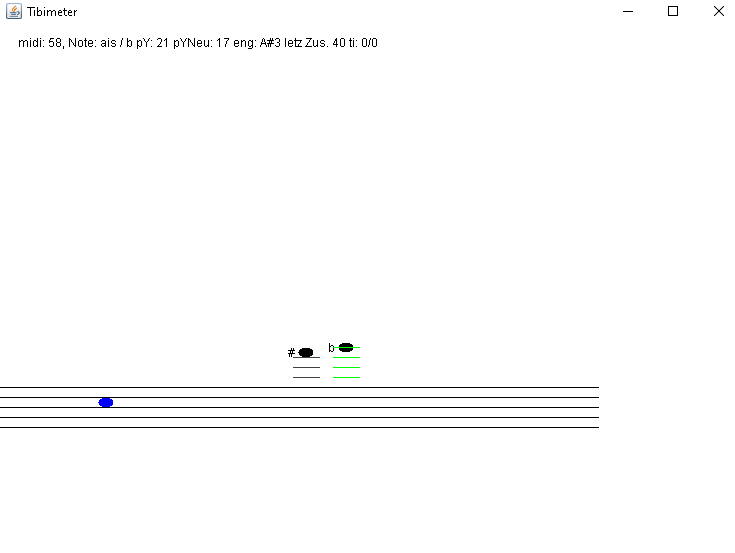

# Midi
Tibor Kalmans open and free repository 

This project will show, how you could write a program in Java (an application) that works together with MIDI data an prints out the currently played note.

I would like to briefly present a program that, together with a small box from the Sonuus company, is able to display tones as notes. (Other midi products from other companies should also work)
I can use it to represent guitar, bass or even voice as notes, graphically (the source code here currently represents the notes for the bass). Or they are also displayed as texts. German and English. The source code can be easily changed if you want to change the note names for French, Italian, Portuguese or Russian.
It's midi based.

Since I will not sell the whole thing, but publish it freely, it does not look that great.
It currently only works monophonically.

Website: http://kalman.website
E-Mail: tibor@kalman.website
